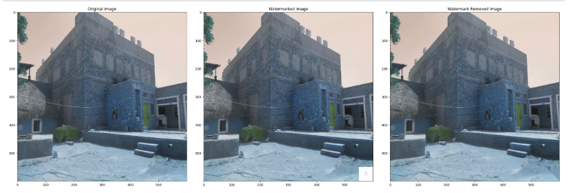
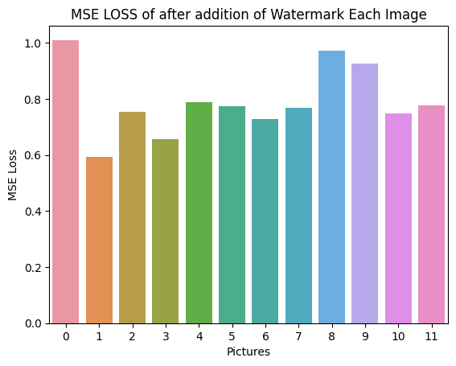

# CV_Project
This is the Computer Vision project 1.

The main objective of the project is to explore different ways of protecting image copyright through image watermarking and identifying potential flaws in the process.
The project will implement watermarking techniques such as visible and invisible watermarking through logos and text and evaluate their effectiveness in protecting copyright.
After then it will implement techniques to remove that watermark from the watermarked images, so as to receive almost original images again. The project will also explore potential flaws or weaknesses in the watermarking process and develop strategies to strengthen image protection. Ultimately, it will also use evaluation measures to check watermarking techniques used and give results accordingly, so that we could compare these techniques. 
Here is the logo we have used for watermarking purpose.  

   
 

After adding this and removing we got the following images:   

   

  
We have also used text at random positions for watermarking as well. As you can see - 

  

For removal of the watermark we have used different techniques. Like for image watermark removal we have used the following methods -  
For the detection of the watermark the methods used are-  
1. Template Matching 
2. Sift 
3. ORB 
After detecting these we have used inpainting method to remove the image watermark. We have tried to do by replacing the mean value of the pixels but that didnot gave good results.  
For text detection and removal we have used sate of the art OCR methods. Like you can see below->  

   

  
After removing this got the following result -  

   

  
We have also used text at random positions for watermarking as well. 
For the evaluation metrics we have used differnt loss functions for calculation of the loss between the (original image, watermarked image) and (original image, Watermark removed image) 
The used evaluation metrices are-  
1. MSE Loss  
2. Log Loss  
3. Pairwise Loss  
We have calculated the loss for each pairs. I am giving an example of loss plot -   

   

  

\newline
